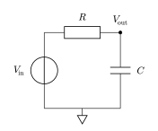

# Your first circuit

Consider a first-order RC low-pass driven by a one-volt step and a unit AC
phasor. The source carries both descriptions because DC/transient and AC
analyses ask different questions of the same circuit.

<!--  -->

```@example first_circuit
using Amber

@circuit TutorialLowPass(; R=10kΩ, C=10nF) begin
    gnd = ground()
    input = node()
    output = node()

    Source = voltage_source(
        input,
        gnd;
        dc=0V,
        ac=1V,
        waveform=Step(low=0V, high=1V, at=0s),
    )
    R1 = resistor(input, output; value=R)
    C1 = capacitor(output, gnd; value=C)
    observe(voltage(output), current(R1))
end

circuit = TutorialLowPass()
check(circuit)
```

`@circuit` is convenience syntax, not a separate circuit language. It creates
an ordinary function returning a [`Circuit`](@ref). Keyword arguments are
ordinary Julia arguments, and loops, conditionals, and helper functions remain
available.

## Operating point

At DC the capacitor is open. With a zero-volt DC source, every node rests at
zero volts.

```@example first_circuit
bias = operating_point(circuit)
(status=bias.stats[:status], output=voltage(bias, :output)[1])
```

## Small-signal response

The transfer function is

```math
H(j\omega)=\frac{1}{1+j\omega RC}.
```

```@example first_circuit
ac = small_signal(circuit, 10Hz => 1MHz; source=:Source, points=101)
cutoff = inv(2π * 10kΩ * 10nF)
index = argmin(abs.(frequencies(ac) .- cutoff))
(frequency=frequencies(ac)[index], magnitude=abs(voltage(ac, :output)[index]))
```

## Step response

The exact response is ``1-e^{-t/(RC)}``. Amber can integrate on a fixed output
grid or choose adaptive internal steps. Supplying `saveat` requests exact
reported times.

```@example first_circuit
step = transient(
    circuit,
    0s => 1ms;
    initial=:discharged,
    saveat=10μs,
    method=:bdf2,
)
(status=step.stats[:status], final_voltage=voltage(step, :output)[end])
```

The result retains an isolated snapshot of the circuit. Later mutations or
sweeps cannot retroactively change currents, power, or provenance extracted
from this result.
