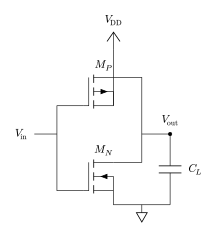

# CMOS inverter

A CMOS inverter is the smallest circuit that exercises complementary MOS
devices, static transfer behavior, capacitive switching, and propagation delay.
Start with separate NMOS and PMOS models: the lower PMOS transconductance
parameter approximates its lower carrier mobility.

<!--  -->

```@example cmos_inverter
using Amber

nmodel = Level1MOSFET(
    threshold_voltage=0.7V,
    transconductance=2mA / V^2,
    channel_length_modulation=0.03 / V,
    body_effect=0.35sqrt(V),
    surface_potential=0.35V,
    gate_source_capacitance=8pF,
    gate_drain_capacitance=2pF,
)
pmodel = Level1MOSFET(
    threshold_voltage=0.7V,
    transconductance=1mA / V^2,
    channel_length_modulation=0.03 / V,
    body_effect=0.35sqrt(V),
    surface_potential=0.35V,
    gate_source_capacitance=8pF,
    gate_drain_capacitance=2pF,
)
```

Both constructors take terminals in drain, gate, source, bulk order. Tying each
bulk to its source rail is the conventional CMOS connection and removes body
bias in this inverter.

```@example cmos_inverter
@circuit CMOSInverter(;
    input_voltage=0V,
    waveform=nothing,
    load_capacitance=20pF,
) begin
    gnd = ground()
    supply = node()
    input = node()
    output = node()
    VDD = voltage_source(supply, gnd; dc=5V)
    Input = voltage_source(input, gnd; dc=input_voltage, ac=1V, waveform)
    PullUp = pmos(output, input, supply, supply; model=pmodel)
    PullDown = nmos(output, input, gnd, gnd; model=nmodel)
    Load = capacitor(output, gnd; value=load_capacitance)
    observe(voltage(input), voltage(output), current(PullUp), current(PullDown))
end
```

A DC transfer sweep is simply a collection of operating-point solves. Inspect
the device regions near the endpoints and switching threshold rather than
looking only at the output curve.

```@example cmos_inverter
inputs = collect(range(0V, 5V; length=51))
outputs = [
    voltage(operating_point(CMOSInverter(input_voltage=value)), :output)[1]
    for value in inputs
]
(first(outputs), last(outputs))
```

For switching behavior, drive the same circuit with a pulse. Exact event mode
places integration breakpoints at input edges; `max_step` still needs to
resolve the analog output transition.

```@example cmos_inverter
switching = CMOSInverter(
    waveform=Pulse(
        low=0V,
        high=5V,
        frequency=10MHz,
        duty_cycle=0.5,
        rise=1ns,
        fall=1ns,
    ),
)
waveforms = transient(switching, 0s => 300ns; event_mode=:exact, max_step=1ns)
(minimum(voltage(waveforms, :output)), maximum(voltage(waveforms, :output)))
```

Repeat with a smaller maximum step and compare delay and supply-current
metrics. This level-1 model is appropriate for learning, topology experiments,
and qualitative design work; it does not replace a process-specific BSIM model
for timing, leakage, or silicon prediction.
