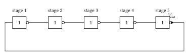

# CMOS ring oscillator

A five-stage ring oscillator is a useful scaling test beyond one CMOS gate. It
contains ten nonlinear transistors, five capacitive state nodes, hierarchical
instances, and a feedback loop whose operating point is unstable. Unlike a
clocked example, its waveform must emerge from the circuit dynamics.

<!--  -->

Define modest level-1 models for the complementary devices. The PMOS uses a
smaller transconductance parameter to approximate lower carrier mobility.

```@example cmos_ring
using Amber

ring_nmos = Level1MOSFET(
    threshold_voltage=0.7V,
    transconductance=2mA / V^2,
    channel_length_modulation=0.03 / V,
    gate_source_capacitance=2pF,
    gate_drain_capacitance=0.5pF,
)
ring_pmos = Level1MOSFET(
    threshold_voltage=0.7V,
    transconductance=1mA / V^2,
    channel_length_modulation=0.03 / V,
    gate_source_capacitance=2pF,
    gate_drain_capacitance=0.5pF,
)
```

Each stage is a reusable hierarchical circuit with explicit signal and supply
ports. Its load capacitor represents the next stage's wiring and input load in
addition to the MOSFETs' intrinsic gate capacitances.

```@example cmos_ring
@circuit RingStage(
    input,
    output,
    supply;
    load_capacitance=5pF,
    initial_output=nothing,
) begin
    gnd = ground()
    PullUp = pmos(output, input, supply, supply; model=ring_pmos)
    PullDown = nmos(output, input, gnd, gnd; model=ring_nmos)
    Load = capacitor(output, gnd; value=load_capacitance)
    if initial_output !== nothing
        initial_voltage(Load, initial_output)
    end
end
```

Connect an odd number of stages in a loop. A perfectly symmetric numerical
initial condition could remain at the unstable equilibrium forever, just as an
idealized physical oscillator needs noise or mismatch to start. Alternating
small capacitor offsets provide an explicit, reproducible startup perturbation.

```@example cmos_ring
@circuit CMOSRingOscillator(;
    supply_voltage=5V,
    load_capacitance=5pF,
    startup_offset=50mV,
) begin
    gnd = ground()
    supply = node()
    stage1 = node()
    stage2 = node()
    stage3 = node()
    stage4 = node()
    stage5 = node()
    VDD = voltage_source(supply, gnd; dc=supply_voltage)
    First = RingStage(stage5, stage1, supply; load_capacitance,
        initial_output=supply_voltage / 2 + startup_offset)
    Second = RingStage(stage1, stage2, supply; load_capacitance,
        initial_output=supply_voltage / 2 - startup_offset)
    Third = RingStage(stage2, stage3, supply; load_capacitance,
        initial_output=supply_voltage / 2 + startup_offset)
    Fourth = RingStage(stage3, stage4, supply; load_capacitance,
        initial_output=supply_voltage / 2 - startup_offset)
    Fifth = RingStage(stage4, stage5, supply; load_capacitance,
        initial_output=supply_voltage / 2 + startup_offset)
    observe(
        voltage(stage1),
        voltage(stage2),
        voltage(stage3),
        voltage(stage4),
        voltage(stage5),
        current(VDD),
    )
end

oscillator = CMOSRingOscillator()
(count(x -> x.kind in (:nmos, :pmos), oscillator.components), check(oscillator))
```

Run long enough for the perturbation to grow and the amplitude to settle. No
event mode is needed because this is an autonomous continuous-time circuit.

```@example cmos_ring
startup = transient(oscillator, 0s => 1μs; max_step=1ns, saveat=1ns)
metrics = harmonic_analysis(
    startup;
    signal=voltage(:stage5),
    interval=0.5μs => 1μs,
)
(metrics.fundamental.frequency, metrics.fundamental.amplitude_rms, metrics.thd)
```

The oscillation frequency is an outcome, not an imposed parameter. Repeat with
smaller time steps, then vary stage count, load capacitance, and transistor
strength. Frequency and waveform shape should converge numerically before they
are interpreted physically. Because Amber's current MOSFET model omits
short-channel and foundry-specific effects, this example demonstrates circuit
and solver scaling rather than silicon-accurate ring-oscillator timing.
