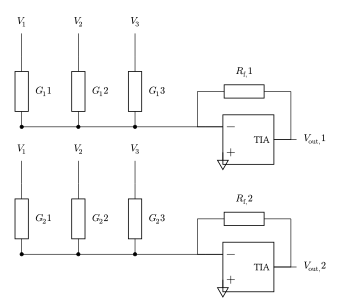

# Matrix-vector multiplication with a conductance crossbar

A conductance crossbar performs an analog matrix-vector product using Ohm's
and Kirchhoff's laws. Input voltages drive the columns and each row sums the
crosspoint currents. A transimpedance amplifier (TIA) holds every row at
virtual ground and converts its summed current back to a voltage:

```math
\mathbf{v}_{out}=-R_f\mathbf{G}\mathbf{v}_{in}.
```

<!--  -->

For a circuit example, create every crosspoint conductance explicitly. This is
preferable to directly defining an output equal to a matrix product because it
retains input loading, the TIA virtual-ground error, device variation, and any
wire or crosspoint parasitics added later. A behavioral matrix equation is a
reasonable shortcut only when those circuit effects are deliberately outside
the model.

```@example conductance_crossbar
using Amber

function ConductanceCrossbar(;
    conductances=[2.0 1.0 0.5; 0.5 1.5 2.0] .* μS,
    inputs=[0.2, 0.5, 0.8] .* V,
    feedback_resistance=100kΩ,
)
    rows, columns = size(conductances)
    length(inputs) == columns ||
        throw(ArgumentError("one input voltage is required per crossbar column"))
    all(>=(0), conductances) ||
        throw(ArgumentError("physical conductances must be nonnegative"))

    c = CircuitBuilder(:ConductanceCrossbar)
    gnd = ground!(c, :gnd)
    positive_rail = node!(c, :positive_rail)
    negative_rail = node!(c, :negative_rail)
    input_nodes = [node!(c, Symbol(:input_, column)) for column in 1:columns]
    summing_nodes = [node!(c, Symbol(:summing_, row)) for row in 1:rows]
    output_nodes = [node!(c, Symbol(:output_, row)) for row in 1:rows]

    add!(c, voltage_source(positive_rail, gnd; dc=5V); name=:PositiveSupply)
    add!(c, voltage_source(gnd, negative_rail; dc=5V); name=:NegativeSupply)
    for column in 1:columns
        source = voltage_source(input_nodes[column], gnd; dc=inputs[column])
        add!(c, source; name=Symbol(:Input_, column))
    end

    for row in 1:rows, column in 1:columns
        device = conductance(
            input_nodes[column],
            summing_nodes[row];
            value=conductances[row, column],
        )
        add!(c, device; name=Symbol(:G_, row, :_, column))
    end

    for row in 1:rows
        tia = opamp(
            gnd,
            summing_nodes[row],
            output_nodes[row],
            positive_rail,
            negative_rail;
            model=BehavioralOpAmp(
                dc_gain=120dB,
                gain_bandwidth=10MHz,
                output_resistance=1Ω,
            ),
        )
        add!(c, tia; name=Symbol(:TIA_, row))

        feedback = resistor(
            output_nodes[row],
            summing_nodes[row];
            value=feedback_resistance,
        )
        add!(c, feedback; name=Symbol(:Rfeedback_, row))
        observe!(c, voltage(output_nodes[row]); name=Symbol(:output_, row))
    end

    finish(c)
end
```

Run a DC operating-point analysis and compare its TIA voltages with the ideal
matrix product.

```@example conductance_crossbar
G = [2.0 1.0 0.5; 0.5 1.5 2.0] .* μS
vin = [0.2, 0.5, 0.8] .* V
Rf = 100kΩ
crossbar = ConductanceCrossbar(
    conductances=G,
    inputs=vin,
    feedback_resistance=Rf,
)
result = operating_point(crossbar)
simulated = [
    voltage(result, Symbol(:output_, row))[1]
    for row in axes(G, 1)
]
expected = -Rf .* (G * vin)
isapprox(simulated, expected; rtol=2e-5)
```

Physical conductances cannot be negative. For a signed weight matrix, encode
positive and negative parts in two crossbars, ``G^+=\max(G,0)`` and
``G^-=\max(-G,0)``, then subtract their TIA voltages with a differential stage.
