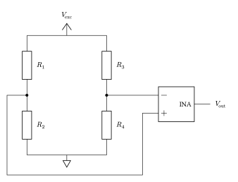

# Precision bridge yield

A precision bridge makes correlation visible. Independent resistor tolerances
predict a different offset distribution from a shared process shift plus local
mismatch. The circuit below combines a Wheatstone bridge with a three-op-amp
instrumentation amplifier.

<!--  -->

```@example bridge
using Amber

@circuit PrecisionBridge(;
    resistance=1kΩ,
    strain=500e-6,
    gain_resistance=1kΩ,
) begin
    gnd = ground()
    positive_rail = node()
    negative_rail = node()
    excitation = node()
    bridge_positive = node()
    bridge_negative = node()
    first_output = node()
    second_output = node()
    first_feedback = node()
    second_feedback = node()
    difference_positive = node()
    difference_negative = node()
    output = node()
    PositiveSupply = voltage_source(positive_rail, gnd; dc=5V)
    NegativeSupply = voltage_source(gnd, negative_rail; dc=5V)
    Excitation = voltage_source(excitation, gnd; dc=2.5V)
    Rbridge1 = resistor(excitation, bridge_positive;
        value=resistance * (1 + strain), tolerance=0.001)
    Rbridge2 = resistor(bridge_positive, gnd; value=resistance, tolerance=0.001)
    Rbridge3 = resistor(excitation, bridge_negative; value=resistance, tolerance=0.001)
    Rbridge4 = resistor(bridge_negative, gnd; value=resistance, tolerance=0.001)
    A1 = opamp(bridge_positive, first_feedback, first_output,
        positive_rail, negative_rail)
    A2 = opamp(bridge_negative, second_feedback, second_output,
        positive_rail, negative_rail)
    Rfeedback1 = resistor(first_output, first_feedback;
        value=10kΩ, tolerance=0.0001)
    Rfeedback2 = resistor(second_output, second_feedback;
        value=10kΩ, tolerance=0.0001)
    Rgain = resistor(first_feedback, second_feedback;
        value=gain_resistance, tolerance=0.0001)
    RinNegative = resistor(first_output, difference_negative; value=10kΩ)
    RinPositive = resistor(second_output, difference_positive; value=10kΩ)
    Rreference = resistor(difference_positive, gnd; value=10kΩ)
    Difference = opamp(difference_positive, difference_negative, output,
        positive_rail, negative_rail)
    RdifferenceFeedback = resistor(output, difference_negative; value=10kΩ)
    Load = resistor(output, gnd; value=100kΩ)
    observe(voltage(bridge_positive, bridge_negative), voltage(output))
end
```

Zero applied strain isolates bridge and amplifier offset from the useful
signal. Check the nominal operating point before introducing variation.

```@example bridge
bridge = PrecisionBridge(strain=0.0)
nominal = operating_point(bridge)
voltage(nominal, :output)[1]
```

Construct a covariance matrix with 80% shared variation and 20% independent
variation across the four bridge resistors.

```@example bridge
using LinearAlgebra

bridge_covariance = fill((0.2Ω)^2 * 0.8, 4, 4) +
    Diagonal(fill((0.2Ω)^2 * 0.2, 4))
bridge_variation = CorrelatedVariation(
    Symbol.("Rbridge" .* string.(1:4) .* ".value"),
    fill(1kΩ, 4),
    bridge_covariance,
)
```

The seeded Monte Carlo run records every draw and failure, so an outlier can be
replayed rather than reverse-engineered from an aggregate histogram.

```@example bridge
offsets = monte_carlo(
    bridge;
    samples=1_000,
    seed=0xA8B3_2026,
    correlated=bridge_variation,
    parallel=true,
    metric=result -> voltage(result, :output)[1],
)
```

Define acceptable yield as ``|V_{offset}|<10\,\mathrm{mV}``, and report both
the estimate and its confidence interval.

```@example bridge
offset_yield = yield_rate(offsets, offset -> abs(offset) < 10mV)
offset_interval = yield_confidence_interval(offsets, offset -> abs(offset) < 10mV)
(offset_yield, offset_interval)
```

One thousand samples can characterize a central distribution but gives limited
evidence about very small tail probabilities.
